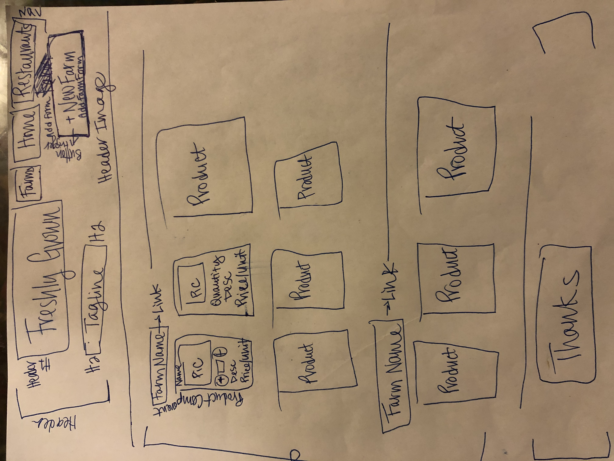
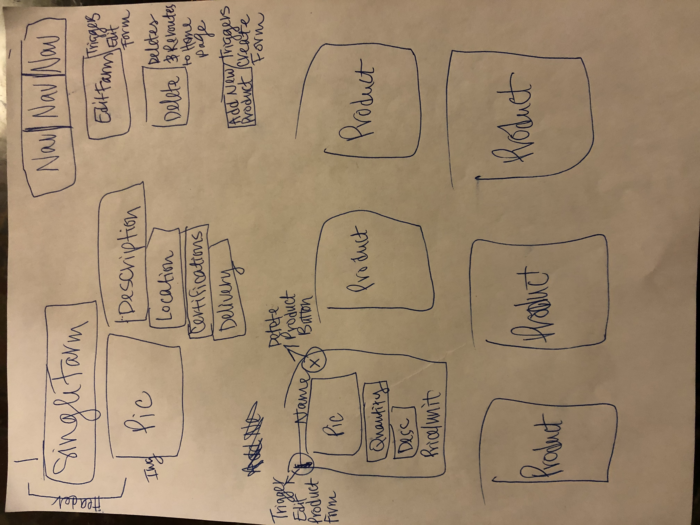
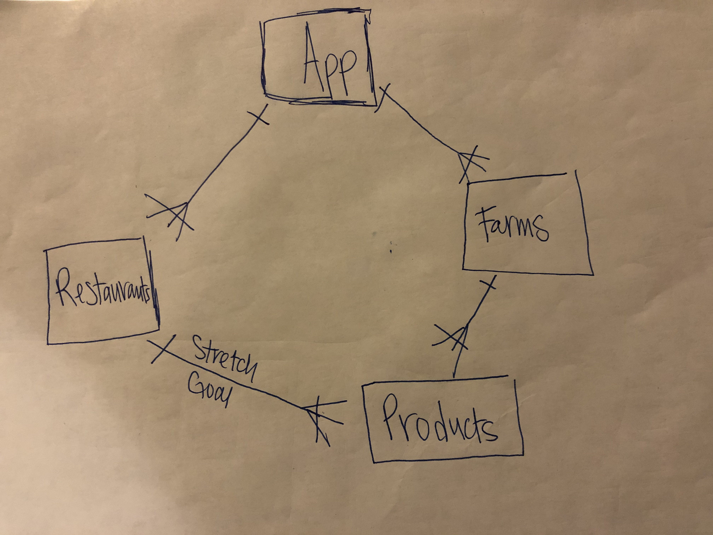
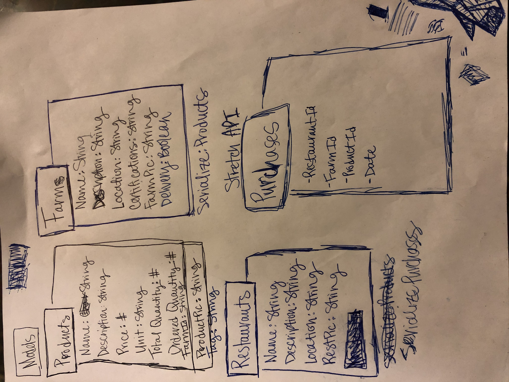

# Freshly Grown

[Trello](https://trello.com/b/UQTP1e8N/project-four)

## Problem Statment

Right now the main way that local farmers sell their wares to restaurants, is by walking in the door and asking if the chef needs anything, obviously not the best marketing strategy.  And on the other side of things, it is often hard for the restaurants to know all the farms in thier area and what products they have without calling each individual farm.  The purpose of this app is to make it easier for farmers to market thier wares to restaurants and easier for restaurants to buy those wares.

## End User

The end users for this app will be both restaurants and farms because the app will facilitate commerece between the two.

